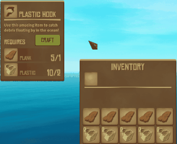
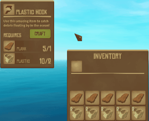
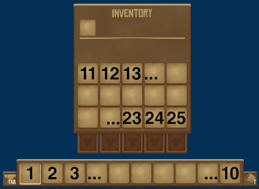

# Inventory Stack

A _minimal_ mod for the game [Raft](https://raft-game.com/) that makes it easier for you to stay organized!

In Raft, items you collect are added to the [first](#inventory-order) available slot in your inventory. Unfortunately, items consumed by building or crafting are _removed_ from the first available slot in your inventory! This makes it difficult to maintain whatever layout of items and materials you have with you without constant manual adjustments.

**Inventory Stack** makes sure items are consumed from the _last_ applicable slot in your inventory. For example:

## Before

## After

# Installation

Following instructions from [raftmodding.com](https://www.raftmodding.com/), download the Raft [mod loader](https://www.raftmodding.com/download) and place the latest release of [InventoryStack](https://www.raftmodding.com/mods/inventory-stack/download) in your mods folder.

# `InventoryStack` Console Command

## Usage

`InventoryStack `*`[command]`*

### Commands

- `h`, `help`
  - Display help message
- `d`, `debug`
  - Toggle additional debug logging

# Inventory Order

